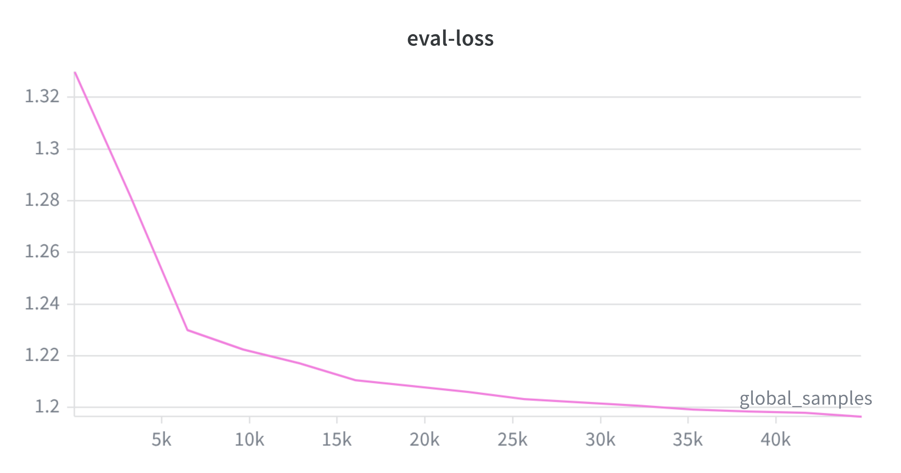

# Using Muon Optimizer with DeepSpeed
## TL;DR
Muon optimizer has gained momentum with more and more use from community and also from Large Foundation Model like Kimi-K2-Thinking.  Now DeepSpeed supports Muon optimizer.

## What is Muon optimizer?
Muon is an optimizer designed for hidden 2D weights of a neural network.  It takes gradient of the weight, computes its momentum, and applies Newton-Schulz iterations to orthogonalize the momentum matrix, then uses this orthogonalized matrix to update the weight[1](https://kellerjordan.github.io/posts/muon/).  Because Muon only maintains one momentum buffer (versus Adam’s two), it uses less memory for optimizer states.

The orthogonalization step is key to Muon’s convergence advantage in pretraining.  In practice, gradient updates for 2D weights in transformers tend to have very high condition numbers — they are nearly low-rank, dominated by a few large singular directions.  By orthogonalizing the momentum matrix, Muon equalizes all singular values, effectively amplifying rare but important update directions that would otherwise be overshadowed.  This leads to better sample efficiency: in NanoGPT speedrunning benchmarks[2](https://github.com/KellerJordan/modded-nanogpt), Muon improved training speed by 35% over AdamW, and at 1.5B parameter scale it reached GPT-2 XL level performance approximately 25% faster than AdamW[1](https://kellerjordan.github.io/posts/muon/).

Muon is used by Keller Jordan’s mod of NanoGPT[2](https://github.com/KellerJordan/modded-nanogpt), Andrej Karpathy’s nanochat[3](https://github.com/karpathy/nanochat), and a variant of Muon (MuonClip) is also used by the production-level LLM Kimi-K2 from MoonShot[4](https://arxiv.org/pdf/2507.20534).  More recently, Zhipu AI’s GLM-5 (744B parameters) confirmed the use of Muon optimizer in both GLM-4.5 and GLM-5 pretraining, along with a “Muon Split” technique that splits MLA up-projection matrices by attention head and orthogonalizes each head independently, addressing a performance gap between MLA and GQA when using Muon[5](https://arxiv.org/abs/2602.15763).

## Muon Optimizer support in DeepSpeed
One of the challenges of applying Muon optimizer to DeepSpeed is that previous optimizers (SGD, Adam) look at gradients as flattened buffers.   Thus it is hard to swap in Muon optimizer in the same place because the gradient buffers are already flattened.   We move the Muon update to `get_flat_partition` function of stage 1 and 2 `DeepSpeedZeroOptimizer` in which per parameter gradients are still in unflattened stages, thus we can easily apply the Muon updates.

Muon optimizer works for hidden 2D gradients.   We apply a parse in model engine initializer to tag the model parameter with `use_muon`, if and only if the model parameter is 2D and is hidden.   When Muon optimizer is used, any gradient with parameter match `use_muon` will use Muon optimizer to update weight.

Note that Muon is a hybrid optimizer: it uses Muon updates only for 2D hidden weights and falls back to Adam for all other parameters (embeddings, layer norms, biases, lm_head).  The DeepSpeed config supports separate learning rates via `muon_lr` (for Muon parameters) and `adam_lr` (for Adam parameters).

## Running DeepSpeed finetune with Muon optimizer
Deepspeed finetune demo[6](https://github.com/delock/deepspeed_finetune_demo) is a demo to use different DeepSpeed training features and compare their performance in a single place.  You can use it to test finetune LLM models with Muon optimizer:
```
git clone https://github.com/delock/deepspeed_finetune_demo
cd deepspeed_finetune_demo
./finetune.sh <NUM_GPUS> <MODEL_NAME> z2_muon.json
```

## Muon Optimizer Convergence Experiment Result

We tested Muon optimizer by finetuning a Qwen2.5-3B model on the tatsu-lab/alpaca dataset.

**Training Configuration:**
- Model: Qwen2.5-3B
- Dataset: tatsu-lab/alpaca
- ZeRO Stage 2, bf16
- Batch size: 32 (4 per GPU), 8 GPUs (A100 40GB)
- 1 epoch (~1460 steps), eval every 100 steps
- Muon lr: 5e-3, Adam lr: 5e-6
- LR schedule: constant (no warmup, no decay)
- Gradient clipping: 1.0



Muon optimizer converges smoothly and shows no overfitting during finetuning.

### Tuning Learning Rate for Muon Optimizer

Since Muon is a hybrid optimizer with separate `muon_lr` and `adam_lr`, finding the optimal learning rate combination requires a different approach than a single-optimizer setup.  We recommend the following two-step process:

1. Fix `adam_lr` as a ratio of `muon_lr` (e.g., `adam_lr = muon_lr / 50`), then sweep `muon_lr` to find the best value.
2. With the best `muon_lr` fixed, sweep `adam_lr` to find the optimal combination.

## Muon Optimizer Memory Savings
Muon optimizer uses less memory for optimizer states than Adam, because it maintains one momentum buffer per parameter instead of two (first and second moment).

### Memory Usage Comparison
Note that Muon is a hybrid optimizer: 2D hidden weights use Muon (1 buffer), while remaining parameters (embeddings, layer norms, lm_head) still use Adam (2 buffers).  The actual memory savings depend on the fraction of parameters that are 2D hidden weights.  For typical transformer models, approximately 90% of parameters are 2D hidden weights, so optimizer state memory is reduced by roughly 45%.  However, because total GPU memory also includes model weights, gradients, and activations, the end-to-end memory reduction is smaller (see measured results below).

| Optimizer | State Buffers per Param | Memory per Parameter |
|-----------|------------------------|---------------------|
| Adam      | 2 (m, v)               | 8 bytes             |
| Muon      | 1 (momentum)           | 4 bytes             |

### Measured GPU Memory: Qwen2.5-3B Finetuning
We measured peak GPU memory during finetuning Qwen2.5-3B on tatsu-lab/alpaca using the same 8xA100 (40GB) configuration described above (batch size 32, ZeRO Stage 2, bf16).

| Optimizer | Peak Memory per GPU | Savings vs AdamW |
|-----------|---------------------|------------------|
| AdamW     | 34.5 GiB            | —                |
| Muon      | 31.4 GiB            | 9%               |

Muon reduces per-GPU memory by approximately 3 GiB (9%) compared to AdamW.  The savings come entirely from optimizer states: Muon parameters store one momentum buffer (4 bytes) instead of Adam's two (8 bytes).  However, because optimizer states are only one component of total GPU memory (alongside model weights, gradients, and activations), the end-to-end reduction is modest.  For larger models or tighter memory budgets, this 9% savings could make the difference between fitting a workload on-device versus requiring CPU offloading.

## What’s Next
Muon is rapidly gaining traction in the community, and production-level adoption by Kimi-K2 (1T parameters) and GLM-5 (744B parameters) signals that it is a serious contender to replace Adam as the default optimizer for large-scale training.  We are actively building out full Muon support in DeepSpeed, with a series of improvements already in flight:

- [x] **ZeRO Stage 2 support** — merged
- [x] **ZeRO Stage 3 support** — merged
- [x] **Gram-Schmidt based Newton-Schulz iteration** — a faster orthogonalization kernel, in review
- [ ] **CPU Offloading** — in progress
- [ ] **MuonClip** — the variant used by Kimi-K2, planned

If you have thoughts, feedback, or contributions on Muon optimizer, welcome to start an issue for discussion or submit a PR to DeepSpeed.  Let’s make Muon rock solid and lightning fast in DeepSpeed!

## Contributors
This work is contributed from Wang, Zhipeng (@PKUWZP); Chi McIsaac(@qimcis) and Ma, Guokai (@delock)
