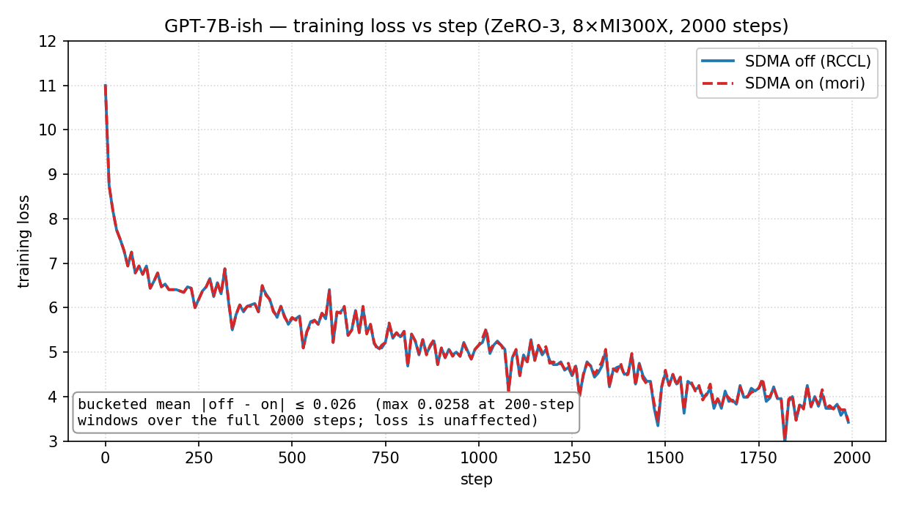
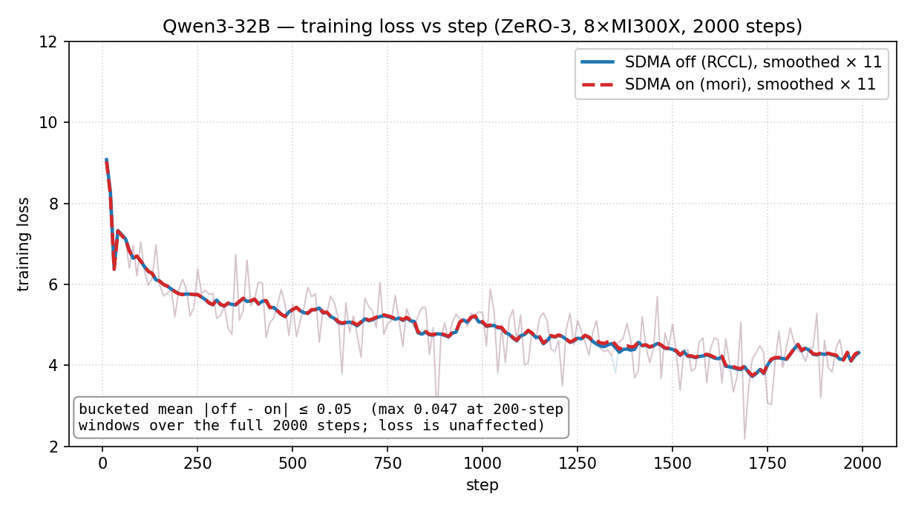

# SDMA-Accelerated ZeRO-3 on AMD GPUs

## Motivation

ZeRO-3 reconstructs each layer with an AllGather right before its forward / backward
pass, and DeepSpeed's `PartitionedParameterCoordinator` prefetches these AllGathers
on a separate stream so that collective and compute can overlap *in time*.  In
practice the time-overlap is already quite good for typical ZeRO-3 workloads.

What's left is **resource** overlap.  On AMD GPUs, RCCL AllGather kernels execute
on the same compute units (CUs) that GEMM and attention run on, and tend to share
wavefront slots, LDS, register file and HBM bandwidth with concurrent compute.
Even when the time-overlap schedule looks near-perfect, the effective compute
throughput during the overlap window can stay below peak because the two workloads
sit on the same physical hardware.

AMD MI300X / MI325X / MI355X contain dedicated **System DMA (SDMA)** copy engines —
independent hardware queues that move data between GPUs over XGMI without using
the CU array.  Routing ZeRO-3's AllGather through SDMA instead of CU-based RCCL
kernels lets collective traffic and compute run on physically separate engines,
leaving CUs largely free for GEMM / attention during the overlap window.  In
workloads where overlap is a meaningful bottleneck this can translate into
end-to-end step-time gains (workload-dependent; see the verified results table
below).

See [RFC #7884](https://github.com/deepspeedai/DeepSpeed/issues/7884) for the
longer design rationale and discussion.

## Overview

End-to-end example for the SDMA fast-path inside
`TorchBackend.all_gather_into_tensor`.  When the runtime is AMD/ROCm,
the [`mori`](https://github.com/ROCm/mori) package is importable, and the user opts in via
`DS_SDMA_ALLGATHER=1`, `deepspeed.comm` acquires the SDMA backend at
`init_distributed()` time and routes WORLD-group
`all_gather_into_tensor` calls through `mori_cpp.AllGatherIntoTensor`
(intra-node SDMA copy on MI300).  RCCL/NCCL is used as the fallback on
any condition that makes the SDMA path unsafe (user did not opt in,
non-WORLD process group, shard larger than the transit buffer,
unsupported dtype, init failure).

This means:

- No `ds_config` knob — control is a single env var.  Works out of the
  box for ZeRO-3 (sequential and coalesced prefetch paths both benefit).
- No source modifications in `partition_parameters.py`: ZeRO-3 just calls
  `dist.allgather_fn`, which lands on the backend's
  `all_gather_into_tensor`.
- Sub-group allgathers (e.g. when ZeRO is initialised with a non-WORLD
  data-parallel group, or with a secondary zero-param group) are routed
  through RCCL/NCCL automatically, since the SDMA backend is bound to
  WORLD.
- Even when mori is installed, the SDMA path stays off unless the user
  sets `DS_SDMA_ALLGATHER=1`, so users keep explicit control over a
  hardware-specific fast-path.

## Environment variables

| Var | Purpose |
|---|---|
| `DS_SDMA_ALLGATHER=1` | **Opt-in switch.**  Required to enable the SDMA fast-path; default is off even when mori is installed.  When set, `MORI_ENABLE_SDMA=1` is auto-exported on your behalf so mori allocates the uncached transit buffers the SDMA kernel needs. |
| `DS_SDMA_ALLGATHER_MAX_NUMEL=N` | Transit buffer size in elements (default 64M = 256 MiB per-rank input, ~2 GiB output on 8 ranks).  Calls larger than this fall back to RCCL/NCCL. |
| `MORI_ENABLE_SDMA=1` | mori's own knob for uncached transit buffers; normally set automatically by DeepSpeed when `DS_SDMA_ALLGATHER=1`.  Export it explicitly only if you want to override or pre-set it. |

The `run_*_sdma_on.sh` scripts export `DS_SDMA_ALLGATHER=1`; the
`run_*_sdma_off.sh` scripts leave it unset (default).  Both variants
share the same `ds_config_zero3.json` — the SDMA decision is made
entirely by env vars.

## Verified results on 8x MI300X

| | GPT-7B-ish | Qwen3-32B |
|---|---|---|
| trainer | `train_zero3.py` | `train_qwen3_zero3.py` |
| seq / micro batch | 2048 / 1 | 1024 / 1 |
| dataset | wikitext-2-raw-v1 | wikitext-103-raw-v1 (10 %) |
| measured / warmup steps | 100 / 10 | 100 / 10 |
| **SDMA off (RCCL)** | 697.7 ms / step (11.6 samples/s) | 1402.5 ms / step (5841 tok/s) |
| **SDMA on (this PR)** | **622.0 ms / step (13.0 samples/s)** | **1263.2 ms / step (6486 tok/s)** |
| **gain** | **+10.85 %** | **+9.93 %** |
| peak mem (rank 0) | 12.12 GB, unchanged off ↔ on | 96.45 GB, unchanged off ↔ on |

The Qwen3-32B number is averaged over two fresh rounds; per-round delta
was +10.85 % and +9.92 %, with 0.29 % run-to-run variance on the off
baseline, so the gap is well outside per-step jitter (~1.5–2.7 %).

Speedup is workload-dependent — gains shrink (or invert) when allgather
cannot be overlapped with compute (e.g. very small payloads, or
`overlap_comm=false`).

### Loss curves match across off ↔ on (2000-step runs)

A long-horizon sanity check on each demo confirms the SDMA path
introduces no numerical drift: 2000 training steps on the same wikitext
shuffle, off vs on traces overlap throughout.  Both trainers use the
standard "concat the corpus + slice into fixed `seq_length` chunks"
pattern, so every sample has the same number of real tokens and per-step
loss has no variance from padding fraction.  Bucketed mean |off − on|
over the full 2000 steps is ≤ **0.026** on GPT and ≤ **0.048** on Qwen3,
well below natural per-step jitter.





## Reproduction

```bash
cd examples/sdma_allgather

# Demo 1 — GPT-7B-ish, ~minute run, no HF download
bash run_gpt_sdma_off.sh    # default (DS_SDMA_ALLGATHER unset), RCCL baseline
bash run_gpt_sdma_on.sh     # DS_SDMA_ALLGATHER=1, SDMA fast-path -> +10.85 %

# Demo 2 — Qwen3-32B, ~few-minute run, weight-free (random init via from_config)
bash run_qwen3_sdma_off.sh  # ~1402 ms / step
bash run_qwen3_sdma_on.sh   # ~1263 ms / step       -> +9.93 %
```

Override knobs via env vars: `SEQ_LEN`, `BATCH_SIZE`, `NUM_STEPS`,
`WARMUP_STEPS`, `NUM_GPUS`, `MODEL`, `DS_CONFIG`.

## Files

```
ds_config_zero3.json            single shared ZeRO-3 + bf16 + DS-default buckets config
run_gpt_sdma_off.sh             GPT-7B-ish + ZeRO-3, SDMA disabled via env var
run_gpt_sdma_on.sh              GPT-7B-ish + ZeRO-3, SDMA enabled via env var
run_qwen3_sdma_off.sh           Qwen3-32B + ZeRO-3, SDMA disabled via env var
run_qwen3_sdma_on.sh            Qwen3-32B + ZeRO-3, SDMA enabled via env var
test_sdma_allgather_zero3.py    unit test exercising the transparent SDMA path
train_qwen3_zero3.py            Qwen3 trainer (self-contained, wikitext)
train_zero3.py                  GPT trainer
images/loss_gpt_2k.png          GPT loss curve, off vs on, 2000 steps
images/loss_qwen3_2k.png        Qwen3-32B loss curve, off vs on, 2000 steps
```
